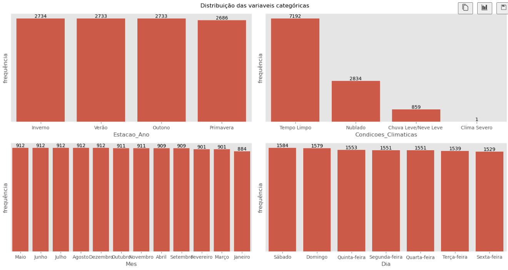
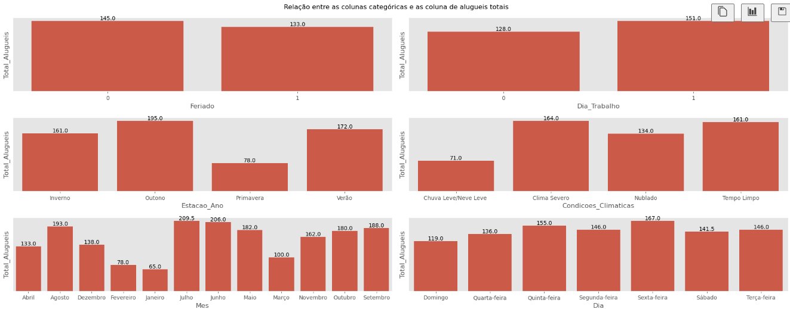
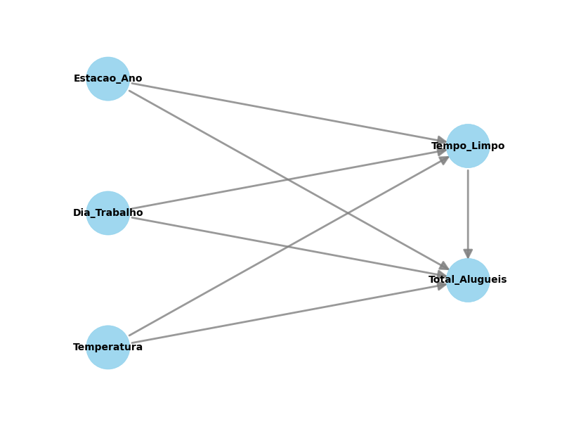

# Análise de Demanda de Bicicletas Elétricas - Yulu

## **Introdução / Problema de Negócio**

Este projeto tem como objetivo analisar a **demanda por bicicletas elétricas compartilhadas da Yulu**, uma das maiores provedoras de micromobilidade da Índia. A empresa, que visa reduzir a congestão urbana e tornar os deslocamentos mais sustentáveis, enfrenta atualmente **queda significativa em suas receitas**.

O desafio do negócio é identificar **quais fatores influenciam a demanda** por bicicletas e como esses elementos podem ser utilizados para **otimizar a alocação da frota, planejar campanhas de incentivo e melhorar a eficiência operacional**.

---

## **Passo a Passo da Análise**

### 1. **Feature Engineering**

Foram criadas novas variáveis e transformações para enriquecer a análise:

* **Novas variáveis temporais:** mês, dia da semana e horário.
* **Transformação de variáveis numéricas:** Estação do ano e condições climáticas foram codificadas para melhor análise.
* **Tradução e padronização das colunas** para facilitar interpretação e visualização dos dados.

### 2. **Análise Exploratória de Dados (EDA)**

* **Análise univariada:** Identificação de distribuições, outliers e medidas centrais (mediana e média).
* **Análise bivariada:** Exploração de relações entre variáveis, como temperatura, estação do ano, dia da semana e condições climáticas em relação à demanda por bicicletas.
* **Análise temporal:** Investigação de **sazonalidades e padrões ao longo do tempo**, como picos de uso por estação do ano, mês e dia da semana, permitindo identificar períodos de maior e menor demanda.

Gráficos EDA(Excemplos)

*Análise Univariada*

*Análise Biariada*

### 3. **Análise Estatística**

Foram aplicadas diversas técnicas para aprofundar o entendimento da relação entre variáveis e demanda:

* **Probabilidade condicional:** Avaliação da chance de a demanda estar acima da mediana considerando diferentes fatores, como estação do ano, feriados, dias de trabalho e condições climáticas.
* **Testes estatísticos não paramétricos:** Teste de Kruskal-Wallis e outros para verificar se diferenças observadas eram estatisticamente significativas, considerando a assimetria dos dados.
* **Inferência causal (DoWhy):** Avaliação do efeito causal de variáveis como condições climáticas e tempo limpo sobre a demanda, com testes de robustez e placebo para validar os resultados.

Gráfico Inferencia Casual

*Inferencia Casual*

### 4. **Dashboard de Acompanhamento**

Foi criado um **dashboard interativo no Google Sheets** para monitorar a demanda e possibilitar análises rápidas e atualizadas, permitindo identificar padrões sazonais, horários de pico e o efeito de diferentes condições climáticas na procura por bicicletas.

---

## **Tecnologias Utilizadas**

* **Python:** Pandas, NumPy, Matplotlib, Seaborn, DoWhy
* **Google Sheets:** Dashboard interativo para acompanhamento
* **Análise Estatística:** Testes não paramétricos, probabilidade condicional e inferência causal

---

## **Conclusões do Projeto**

* **Principais fatores que aumentam a demanda:**

  * Estações quentes (verão e outono)
  * Dias com **céu limpo**
  * Temperatura e sensação térmica mais altas
  * Horários de pico (7h–20h)
  * Padrões sazonais claros ao longo do ano (identificados na análise temporal)

* **Fatores com influência mínima ou não significativa:**

  * Feriados
  * Dias de trabalho

* **Recomendações:**

  * Priorizar manutenção, distribuição e campanhas de incentivo nos **dias de clima favorável, horários de pico e períodos de maior demanda sazonal**.
  * Incorporar **temperatura, sensação térmica e clima** em modelos preditivos de demanda.
  * Evitar basear estratégias apenas em feriados ou dias úteis, já que seu impacto é limitado.

Com isso, o projeto fornece **insights acionáveis** para otimizar o uso da frota, planejar operações e melhorar a experiência dos usuários de bicicletas elétricas da Yulu.

